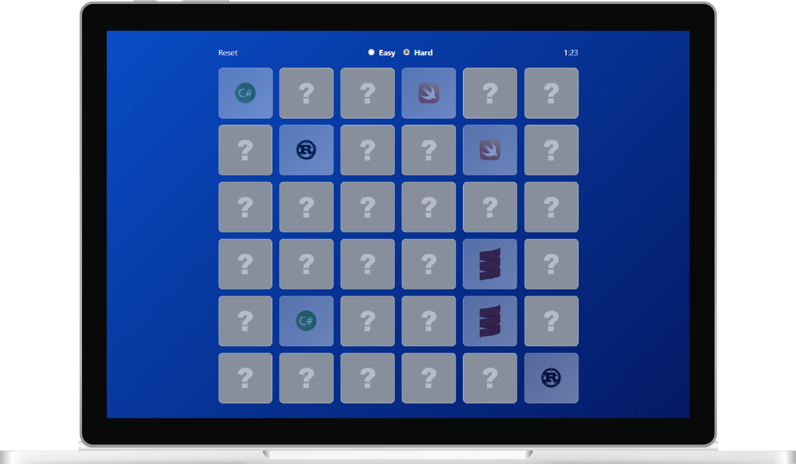
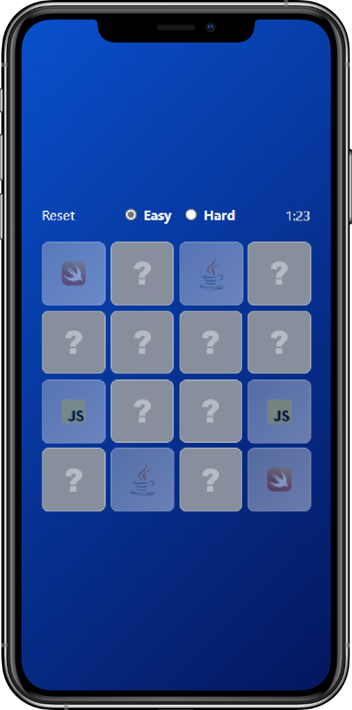

&nbsp;

<p align=center>
    
</p>

<h1 align=center>Memory Languages</h1>

<p align=center>
    <a href='https://gabriel-dp.github.io/Memory_Languages/'>gabriel-dp.github.io/Memory_Languages</a>
    <br/><br/>
    
    &nbsp;
    
    &nbsp;

</p>

&nbsp;

<p align=center>
    
    &nbsp;&nbsp;&nbsp;&nbsp;
    
</p>

&nbsp;

## 💡 Motivation

That is my first TypeScript project, after a long time delaying starting to use TSX instead of JSX in React.

Obviously, a lot of code could be written better, but this minigame was a great opportunity to learn more about TS and its features.

A Memory Game needs no description, just play it yourself and have fun! 😜

&nbsp;

## 🖥️ Running locally

```bash
# Clone repository
git clone https://github.com/gabriel-dp/Memory_Languages

# Install node_modules
npm install

# Run local server
npm run dev
```
